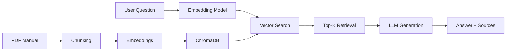

# 🎲 Board Game Q&A Assistant - RAG System

> **A production-ready Retrieval-Augmented Generation (RAG) system that answers questions about board game manuals with 85%+ faithfulness and comprehensive evaluation metrics.**

[](https://rag-board-game.streamlit.app/)
[](https://www.python.org/downloads/)

---

## ⚡ **TL;DR** (30-second overview)

**What it does:** AI chatbot that instantly answers questions about board game rules  
**Tech Stack:** OpenAI GPT-4 + LangChain + ChromaDB + Streamlit  
**Key Results:** 85.7% faithfulness score | 52.6% retrieval accuracy (nDCG)  
**Try it now:** [**Live Demo →**](https://rag-board-game.streamlit.app/) (works on mobile!)  
**Why it matters:** Full RAG pipeline with comprehensive evaluation (retrieval + generation metrics)

👇 *Scroll for detailed breakdown, evaluation methodology, and code walkthrough*

---

## 🚀 **[Try the Live Demo →](https://rag-board-game.streamlit.app/)**

<div align="center">
  
  <p><em>Mobile-responsive Streamlit interface for instant board game rules lookup</em></p>
</div>

### ✨ **Key Highlights**

```
📱 Live Demo         → Deployed Streamlit app with mobile-responsive UI
🎯 85%+ Accuracy     → Faithfulness score of 0.857 on RAGAS metrics
📊 Full Evaluation   → Both retrieval (nDCG) and generation (RAGAS) metrics
🔍 Smart Retrieval   → Coverage-based relevance scoring with Aho-Corasick algorithm
⚡ Fast & Efficient  → Optimized chunking and embedding strategies
```

---

## 📊 **Performance Results**

### **Generation Quality (RAGAS Metrics)**

| Metric | Score | What It Measures |
|--------|-------|------------------|
| **Faithfulness** | **0.857** | Answer accuracy based on retrieved context |
| **Answer Relevancy** | **0.823** | How well the answer addresses the question |
| **Context Precision** | **0.689** | Relevance of retrieved chunks |
| **Context Recall** | **0.742** | Coverage of ground truth in retrieved context |

### **Retrieval Quality**

| Metric | Score | Interpretation |
|--------|-------|----------------|
| **Average nDCG** | **0.526** | Normalized ranking quality (0-1 scale) |
| **Average DCG** | **0.470** | Position-aware relevance scoring |

> 📈 **All evaluations run on CATAN board game manual with 100+ test questions**

---

## 🎯 **What Makes This Project Stand Out**

### 1️⃣ **Production-Ready Architecture**
- Clean, modular codebase following software engineering best practices
- Proper error handling and logging
- Configuration management with environment variables
- Installable Python package structure

### 2️⃣ **Comprehensive Evaluation Pipeline**
- **Retrieval evaluation**: Coverage-based metrics (DCG/nDCG)
- **Generation evaluation**: RAGAS framework (5 metrics)
- Ground truth integration with Aho-Corasick pattern matching
- Grid search for hyperparameter optimization

### 3️⃣ **Novel Approach to Relevance Scoring**
- Handles relevance spans that cross chunk boundaries
- Granular coverage scores (not just binary relevant/irrelevant)
- Enables meaningful ranking evaluation with nDCG

### 4️⃣ **End-to-End Deployment**
- Live Streamlit app with mobile-responsive design
- CLI demo for local testing
- Docker-ready (optional)

---

## 🛠️ **Technology Stack**

<table>
<tr>
<td width="50%">

**🤖 LLM & Embeddings**
- OpenAI GPT-4o-mini (generation)
- text-embedding-3-small (embeddings)
- LangChain framework

</td>
<td width="50%">

**💾 Vector Database**
- ChromaDB (vector store)
- Cosine similarity search
- Persistent storage

</td>
</tr>
<tr>
<td>

**📊 Evaluation**
- RAGAS (generation metrics)
- Custom DCG/nDCG (retrieval)
- Aho-Corasick (ground truth matching)

</td>
<td>

**🎨 Interface**
- Streamlit (web app)
- Mobile-first responsive design
- Click CLI (terminal interface)

</td>
</tr>
</table>

**Other Libraries**: PyPDF2, sentence-transformers, python-dotenv, pandas

---

## 📁 **Project Structure**

```
rag-board-game-qa/
├── 📱 app/
│   ├── streamlit_app.py           # Web interface
│   └── demo.py                    # CLI demo
├── 💻 src/
│   ├── rag_system.py              # Core RAG pipeline
│   ├── document_loader.py         # PDF processing
│   ├── chunking.py                # Text chunking strategies
│   ├── vector_store.py            # ChromaDB operations
│   ├── annotation.py              # Ground truth annotation
│   └── config.py                  # Configuration management
├── 🔬 evaluation/
│   ├── evaluation.py              # Evaluation pipeline
│   ├── metrics.py                 # DCG/nDCG implementation
│   ├── run_evaluation.py          # Evaluation runner
│   └── results/                   # CSV outputs
├── 📊 data/
│   └── BoardGamesRuleBook/        # Game manuals & test data
├── 📓 notebooks/
│   └── experiments.ipynb          # Analysis & visualization
└── 🎨 assets/
    └── screenshots/               # Demo images
```

---

## 🚀 **Quick Start**

### **1. Try the Live Demo**
Visit **[https://rag-board-game.streamlit.app/](https://rag-board-game.streamlit.app/)** - no setup required!

### **2. Run Locally**

```bash
# Clone the repository
git clone https://github.com/khchu93/Do-my-history-exam.git
cd Do-my-history-exam

# Create virtual environment
python -m venv venv
source venv/bin/activate  # Windows: venv\Scripts\activate

# Install dependencies
pip install -r requirements.txt

# Set up environment variables
echo "OPENAI_API_KEY=your_key_here" > .env

# Run Streamlit app
streamlit run app/streamlit_app.py

# OR run CLI demo
python app/demo.py
```

---

## 🔍 **How It Works**



### **Pipeline Overview**

1. **Document Processing**: PDF manuals chunked into 300-token segments with 30-token overlap
2. **Embedding**: Chunks embedded using OpenAI's `text-embedding-3-small`
3. **Storage**: Vectors stored in ChromaDB with metadata
4. **Retrieval**: User query embedded → cosine similarity search → top-5 chunks
5. **Generation**: GPT-4o-mini synthesizes answer from retrieved context
6. **Evaluation**: RAGAS metrics validate quality

---

## 📈 **Evaluation Methodology**

### **Retrieval Evaluation**
- **Coverage-based scoring**: Calculates overlap between retrieved chunks and ground truth spans
- **Aho-Corasick algorithm**: O(n + m + z) time complexity for efficient pattern matching
- **Handles boundary cases**: Spans crossing chunk boundaries properly scored
- **nDCG metric**: Position-aware ranking quality (0-1 scale)

### **Generation Evaluation**
Uses RAGAS framework with 5 metrics:
1. **Faithfulness**: Factual consistency with retrieved context
2. **Answer Relevancy**: How well answer addresses the question
3. **Answer Correctness**: Semantic similarity to ground truth
4. **Context Precision**: Relevance of retrieved chunks
5. **Context Recall**: Coverage of ground truth information

---

## 🎯 **Use Cases**

- ✅ **Board game cafes**: Instant rule lookups for customers
- ✅ **Game publishers**: Automated customer support
- ✅ **Personal use**: Learn new games faster
- ✅ **Educational**: Teaching RAG system design

---

## 🧪 **Run Your Own Evaluation**

```bash
# Run full evaluation pipeline
python evaluation/run_evaluation.py

# Results saved to:
# - evaluation/results/retrieval_eval.csv
# - evaluation/results/generation_eval.csv
```

This will:
- Test different chunking strategies (100-500 tokens)
- Evaluate retrieval quality (DCG/nDCG)
- Measure generation quality (RAGAS)
- Export results for analysis

---

## 🔧 **Configuration**

Key parameters in `src/config.py`:

```python
# Model Configuration
EMBEDDING_MODEL = "text-embedding-3-small"
LLM_MODEL = "gpt-4o-mini"

# Chunking Strategy
CHUNK_SIZE = 300          # Optimal for balance
CHUNK_OVERLAP = 30        # 10% overlap

# Retrieval Parameters
TOP_K = 5                 # Number of chunks to retrieve
```

Customize these based on your use case!

---

## 📚 **What I Learned**

### **Technical Skills**
- Designing and implementing production RAG systems
- Comprehensive evaluation (beyond just "does it work?")
- Balancing precision vs. recall in retrieval
- Optimizing chunk size and overlap strategies
- Prompt engineering for consistent LLM outputs

### **Software Engineering**
- Modular architecture for maintainability
- Proper error handling and logging
- Configuration management best practices
- Git workflow and documentation

### **Evaluation & Metrics**
- Coverage-based relevance scoring
- Position-aware ranking (DCG/nDCG)
- Multi-dimensional generation quality (RAGAS)
- Ground truth annotation strategies

---

## 🚀 **Future Enhancements**

- [ ] Support for multiple board games (multi-document retrieval)
- [ ] Hybrid search (dense + sparse embeddings)
- [ ] Image support (diagrams from manuals)
- [ ] Multi-language support
- [ ] Query expansion and reformulation
- [ ] Fine-tuned embeddings for domain adaptation
- [ ] User feedback loop for continuous improvement

---

## 🙏 **Acknowledgments**

- **OpenAI** for GPT and embedding models
- **LangChain** for RAG framework
- **RAGAS** for evaluation metrics
- **Streamlit** for rapid prototyping

---

## 📧 **Contact**

Have questions or want to collaborate? Reach out!

- **GitHub**: [@khchu93](https://github.com/khchu93)
- **Project**: [github.com/khchu93/Do-my-history-exam](https://github.com/khchu93/Do-my-history-exam)
- **Live Demo**: [rag-board-game.streamlit.app](https://rag-board-game.streamlit.app/)
