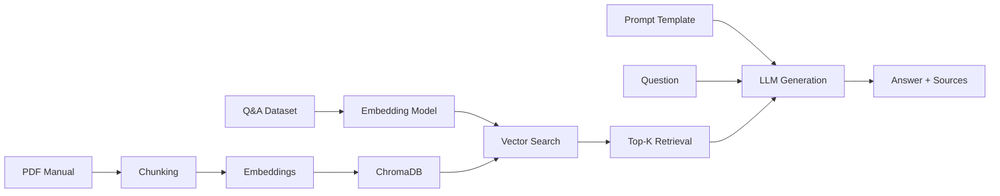

## 🎲 Board Game Rulebook Q&A Chatbot (RAG) - CATAN Game Master

> **Ask any question about CATAN. Get instant, rule-accurate answers grounded in the official manual.**

Have a question about how to play **CATAN**?<br>
Just type your question into the input box and press **Enter** (or click **Search**).<br>
You'll instantly see:
- **Your question and the generated answer**, shown below the input
- An expandable **“View Source Passages”** section, where you can read the top-K rulebook snippets the system used to generate the answer

Not sure what to ask? <br>
Explore the **"Popular Questions"** section and click any question to auto-fill it and generate an answer.

---

### **Live Demo** → **[Link](https://broadgame-question-and-answer.streamlit.app/)** (Mobile & desktop friendly)


---

### What This Project Demonstrates
- **End-to-end RAG system** with chunking, embedding, vector search, and LLM answering  
- **High-fidelity answers** grounded strictly in top-k retrieved rule text, with prompt constraints to minimize hallucination.
- **Full retrieval evaluation:** NDCG, MRR, Mean Retrieval Similarity(MRS), HitRate@K  
- **Full generation evaluation:** RAGAS (Faithfulness, Relevancy, Correctness)  
- **Hyperparameter tuning** across chunk size, overlap, k, and similarity metrics  
- **Clean, mobile-friendly Streamlit UI**  
- **Modular, production-style architecture** (document loader, retriever, evaluator, UI)

---

### Key Results

#### **Best Retrieval Settings**
- **Chunk Size:** 125  
- **Chunk Overlap:** 120  
- **Top-K:** 5  
- **Similarity search:** Cosine  
These achieved the highest average retrieval score across [nDCG](#Retrieval-Metrics), [MRR](#Retrieval-Metrics), [Overall-MRS](#Retrieval-Metrics), and [Mean HitRate@K](#Retrieval-Metrics).

| Summary Metric | Chunk | Overlap | Top-K | Score |
|----------------|--------|----------|--------|--------|
| [Average](#Retrieval-Metrics) | 125 | 120 | 5 | **0.7874** |
| [Prioritize Ranking](#Retrieval-Metrics) | 125 | 120 | 5 | **0.7647** |

#### **Generation Evaluation (RAGAS, 40 Qs)**
| Metric | Score |
|--------|--------|
| [Faithfulness](#Summary-Metrics) | XX.X% |
| [Answer Relevancy](#Summary-Metrics) | XX.X% |
| [Answer Correctness](#Summary-Metrics) | XX.X% |
| [Context Precision](#Summary-Metrics) | XX.X% |
| [Context Recall](#Summary-Metrics) | XX.X% |


### Metric Detail
#### Retrieval Metrics

| Metric | Description | Scale | Interpretation |
|:--------|:----------------|:-----|:---|
| **Average NDCG(Normalized Discounted Cumulative Gain)** | Measures how close the retrieved ranking is to an ideal ordering. | 0 - 1 | Shows how close the chunk ranking is to the ideal |
| **MRR(Mean Reciprocal Rank)** | Measures how early the first relevant chunk appears. | 0 - 1 | Shows how early a relevant chunk is retrieved |
| **Overall MRS(Mean Retrieval Similarity)** | Measures the average semantic similarity between queries and top-k retrieved chunks | 0 - 1 | Shows how semantically close retrieved chunks are to the query. |
| **Mean HitRate@K** | Measures how often top-k contains at least one relevant chunk. | 0 - 1 | Shows whether top-k consistently includes a relevant chunk |

#### Summary Metrics
| Summary Metric | Equation |
|:--------|:----------------|
| **Average** | 0.2 x Average NDCG + 0.2 x MRR + 0.2 x Overall MRS + 0.2 x Mean HitRate@K |
| **Ranking Prioritize** | 0.4 x Average NDCG + 0.4 x MRR + 0.1 x Overall MRS + 0.1 x Mean HitRate@K |

[Back](#Key-Results)
#### Generation Metrics

| RAGAS Metric | Description | Scale | Interpretation |
|:--------|:-------------------------------|:------|:-------------------------------|
| **Faithfulness** | Measures whether the generated answer is consistent with the retrieved context. | 0–1 | Shows how closely the answer follows the source context without hallucination |
| **Answer Relevancy** | Measures how relevant the generated answer is to the user’s question. | 0–1 | Shows how well the answer addresses the question |
| **Answer Correctness** | Measures whether the generated answer is factually correct based on the reference. | 0–1 | Shows whether the answer contains correct information |
| **Context Precision** | Measures the fraction of retrieved chunks that are actually relevant. | 0–1 | Shows how many retrieved chunks are truly relevant to the query |
| **Context Recall** | Measures the fraction of all relevant chunks that were successfully retrieved. | 0–1 | Shows how completely relevant chunks are captured by the retriever |

[Back](#Key-Results)

---

### **Performance Results**

#### **Retrieval Evaluation**
> 📈 **Using a dataset of 10 questions, we present the following chart summarizing the retrieval evaluation results:**


| Metric | Description | Scale |
|:--------|:----------------|:-----|
| **Average NDCG(Normalized Discounted Cumulative Gain)** | Measures how well the retrieved chunks are ranked compared to an ideal. | 0 - 1 |
| **MRR(Mean Reciprocal Rank)** | Captures how early the first relevant chunk appears in the ranking, with higher values meaning earlier retrieval. | 0 - 1 |
| **Overall MRS(Mean Retrieval Similarity)** | Indicates the proportion of queries where at least one relevant chunk appears within the top-k results. | 0 - 1 |
| **Mean HitRate@K** | Represents the average similarity score of the top-k retrieved chunks across all queries. | 0 - 1 |

Summary metrics are calculated as follows:
| Summary Metric | Equation |
|:--------|:----------------|
| **Average** | 0.2 x Average NDCG + 0.2 x MRR + 0.2 x Overall MRS + 0.2 x Mean HitRate@K |
| **Ranking Prioritize** | 0.4 x Average NDCG + 0.4 x MRR + 0.1 x Overall MRS + 0.1 x Mean HitRate@K |

Best hyperparameter combination with a dataset of 10 questions
| Summary Metric | Chunk Size | Chunk Overlap | Top k | Scores |
|:--------|:----------------|:-----|:-----|:----|
| **Average** | 125 | 120 | 5 | 0.7874 |
| **Prioritize Ranking** | 125 | 120 | 5 | 0.7647 |
 
#### **Generation Evaluation (RAGAS)**

> 📈 **Using a dataset of 40 questions and the best hyperparameter combination identified during retrieval evaluation, we obtained the following results for the generation evaluation:**

| RAGAS Metric | Description | Scale | Score |
|:--------|:-------|:------------------|:----|
| **Faithfulness** | Assesses whether the answer is consistent with the retrieved context, without hallucination. | 0 - 1 |  |
| **Answer Relevancy** | Captures how relevant the generated answer is to the user’s question. | 0 - 1 |  |
| **Answer Correctness** | Measures whether the model’s answer is factually correct based on the reference. | 0 - 1  |  |
| **Context Precision** | Fraction of retrieved chunks that are actually relevant to the question. | 0 - 1  |  |
| **Context Recall** | Fraction of all relevant chunks that were successfully retrieved. | 0 - 1  |  |

| Metric | Score |
|:--------|:----------------|
| **Average NDCG(Normalized Discounted Cumulative Gain)** | |
| **MRR(Mean Reciprocal Rank)** | |
| **Overall MRS(Mean Retrieval Similarity)** | |
| **Mean HitRate@K** | |
---

### **Technology Stack**

<table>
<tr>
<td width="50%">

**LLM & Embeddings**
- GPT-3.5 turbo (generation, chatbot, ragas evaluation)
- text-embedding-ada-002 (embeddings)
- LangChain framework

</td>
<td width="50%">

**Vector Database**
- ChromaDB (Vector Store)
- Cosine similarity search

</td>
</tr>
<tr>
<td>

**Evaluation**
- RAGAS (Generation Metrics)
- DCG/nDCG/MRR/Mean MRS/Mean HitRate@K (Retrieval Metrics)

</td>
<td>

**Interface**
- Streamlit (web app & Mobile)

</td>
</tr>
</table>

---

### **Project Structure**

```
rag-board-game-qa/
├─── demo.py                       # Demo
├── 📱 app/
│   ├── streamlit_app.py           # Web interface
├── 💻 src/
│   ├── __init__.py                # Version control
│   ├── rag_system.py              # Core RAG pipeline
│   ├── document_loader.py         # PDF processing
│   ├── chunking.py                # Text chunking strategies
│   ├── vector_store.py            # ChromaDB operations
│   ├── annotation.py              # Ground truth annotation
│   ├── exception.py               # Exception management
│   ├── prompts.py                 # Prompts templates management
│   └── config.py                  # Configuration management
├── 🔬 evaluation/
│   ├── __init__.py                # Version control
│   ├── evaluation.py              # Evaluation pipeline
│   ├── metrics.py                 # DCG/nDCG implementation
│   ├── run_evaluation.py          # Evaluation runner
│   └── results_csv/               # CSV outputs
├── 📊 data/
│   └── BoardGamesRuleBook/        # Game manuals & test data
└── 📓 notebooks/
    └── rag_experiments.ipynb      # Analysis & visualization
```

---

### **Quick Start**

#### **1. Try the Online Demo**
Visit **[Link](https://rag-board-game.streamlit.app/)**

#### **2. Run Locally**

```bash
# Clone the repository
git clone https://github.com/khchu93/Do-my-history-exam.git
cd Do-my-history-exam

# Create virtual environment
python -m venv venv
source venv/bin/activate  # Windows: venv\Scripts\activate

# Install dependencies
pip install -r requirements.txt

# Set up environment variables
echo "OPENAI_API_KEY=your_key_here" > .env

# Run Streamlit app
streamlit run app/streamlit_app.py

# OR run CLI demo
python app/demo.py
```

---

### **How It Works**



#### **Pipeline Overview**

1. **Document Processing**: PDF manuals chunked into 300-token segments with 30-token overlap
2. **Embedding**: Chunks embedded using OpenAI's `text-embedding-3-small`
3. **Storage**: Vectors stored in ChromaDB with metadata
4. **Retrieval**: User query embedded → cosine similarity search → top-5 chunks
5. **Generation**: GPT-3.5-Turbo synthesizes answer from retrieved context
6. **Evaluation**: Traditional retrieval eval metrics + RAGAS generation eval metrics validate quality

---

### **Run Your Own Evaluation**

```bash
# Run full evaluation pipeline
python evaluation/run_evaluation.py

# Results saved to:
# - evaluation/results/retrieval_eval.csv
# - evaluation/results/generation_eval.csv
```

This will:
- Test different chunking strategies (chunk_size, chunk_overlap, k)
- Evaluate retrieval quality (DCG/nDCG/MRR/Overall MRS/Mean HitRate@K)
- Measure generation quality (RAGAS)
- Export results for analysis

---

### **Configuration**

Hyperparameters in `src/config.py`:

```python
# Paths
DATA_DIR = Path("data/BoardGamesRuleBook")
PDF_PATH = DATA_DIR / "CATAN.pdf"
# TRAINING_QA_PATH = DATA_DIR / "CATAN_eval_small.json" # retrieval eval set
TRAINING_QA_PATH = DATA_DIR / "CATAN_eval_long.json"    # generation eval set

# Model settings
EMBEDDING_MODEL = "text-embedding-ada-002"
LLM_MODEL = "gpt-3.5-turbo"
LLM_TEMPERATURE = 0
SIMILARITY_SEARCH = "cosine"

# Chunking parameters (demo.py and streamlit_app.py)
DEMO_CHUNK_SIZE = 125
DEMO_CHUNK_OVERLAP = 120
DEMO_TOP_K = 5

# Evaluation parameters (run_evaluation.py)
CHUNK_SIZES = [125]
CHUNK_OVERLAPS = [120]
TOP_K_VALUES = [3,5,7,10]

# Prompt template
PROMPT_TEMPLATE = "default"
```

---

### **What I Learned**

#### **Technical Skills**
- Designing and implementing RAG systems with LangChain + Chroma + OpenAI
- Retrieval + Generation Evaluation
- RAG system's hyperparameter tuning
- Prompt engineering for consistent LLM outputs

#### **Software Engineering**
- Modular architecture for maintainability
- Proper error handling and logging
- Configuration management best practices
- Git workflow and documentation

#### **Evaluation & Metrics**
- Coverage-based relevance scoring (binary vs grade score)
- Position-aware ranking (DCG/nDCG)
- RAGAS
- Ground truth annotation strategies

---

### **To Explore**
- [ ] Experiment with different prompt templates to improve answer quality
- [ ] Test alternative text splitters (currently using character-level; consider token-, subword-, or word-level splitting)

### **Future Enhancements**

- [ ] Support board game rulebook upload
- [ ] Support capturing rulebooks via cellphone camera (image input)
- [ ] Support for multi-language rulebooks
- [ ] Query expansion and reformulation

---
